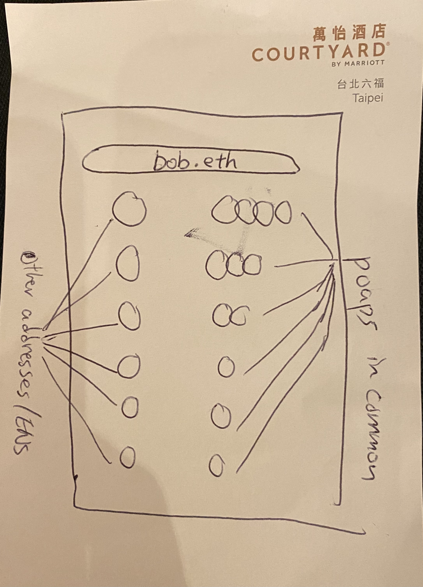

# ipoapoapu 

Find Web3 friends who share the same POAPs as you.



Well the API is working, but it is extremely slow and laggy. Need to use GraphQL. 


Instructions 

```
/api/search?address=Enter_ENS_or_Address
```


Todos 
- [x] Basic API
- [x] Basic Frontend
- [ ] Migrate to use GraphQL
- [ ] Filter duplicate events from each owner's event list
- [ ] Filer "self" from the owner list
- [ ] Refine Frontend

